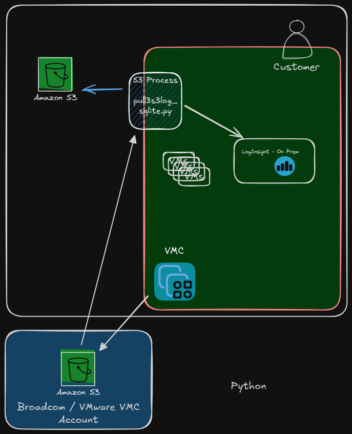
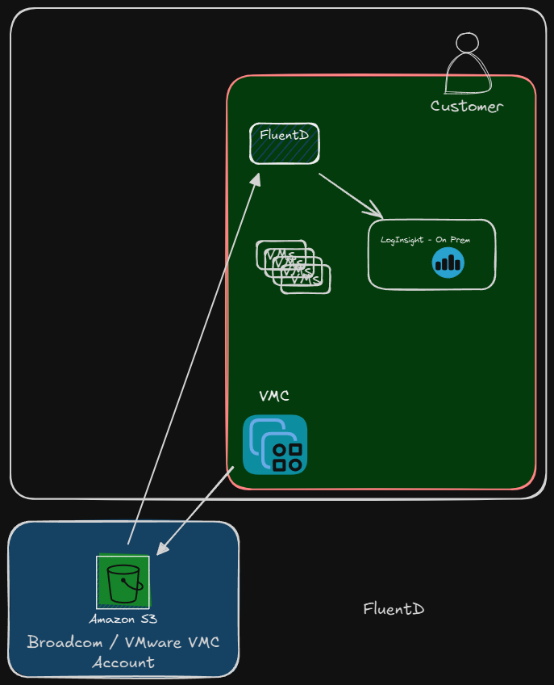

Scripts for Dealing with VMC Logging to S3 Bucket

This has been created as a proof of concept to pull S3 logs from the S3 bucket provided by VMC as perf the following blog.

Based on https://blogs.vmware.com/cloud-foundation/2024/09/18/vmware-cloud-on-aws-sddc-logs-update/



## Python Scripts

'logtos3.py' - writes a NDJSON file in GZIP to the S3 bucket 
- Includes example code from VMC log.
- It runs for 30 minutes and puts in the log messages over a random interval.

'pulls3log-sqlite.py' - pulls the s3 NDJSON log, writes to a JSON http endpoint and stores in local bucket 
- Uses sqlite for key file to index S3 bucket files
- Sends only new files to HTTP endpoint when seen in S3 bucket
- Could be used a time based polling script to pull data from S3 periodically
- Tracks if log data cannot be written to JSON endpoint
- Sends file to local S3 bucket for local processing.

Use:
- Create a .env file in the directory:

```
bucket_name=<s3bucketname>
url=<HTTP Endpoint>
local_bucket=<localbucketforstorage>
url=<url for log endpoint>
sqlitedb=s3logger.db
```


## FluentD


The plugin and config for FluentD provide the capability to download the S3 NDJSON Zipped file and send them as JSON 
events to a HTTP endpoint.  It uses the downloaded files as an index on the local machine then sends them to a HTTP 
endpoint - in this example VCF Log.

To use you will need to install the aws-sdk-s3 with:
`gem install aws-sdk-s3` - authentication uses the same process as boto.  Place the credentials in secure location.


Config Example:

```
<source>
  @type s3_noindex
  region ap-southeast-2
  s3_bucket s3bucketfortesting
  download_directory /opt/logs/pgs3
  timestamp_directory /opt/logs/pgs3ts
  tag s3_noindex
  interval 10
</source>
```

Interval sets the time to poll the bucket.

## Setup

- Setup Amazon credentials for boto and aws-sdk-s3 - https://boto3.amazonaws.com/v1/documentation/api/latest/guide/credentials.html
